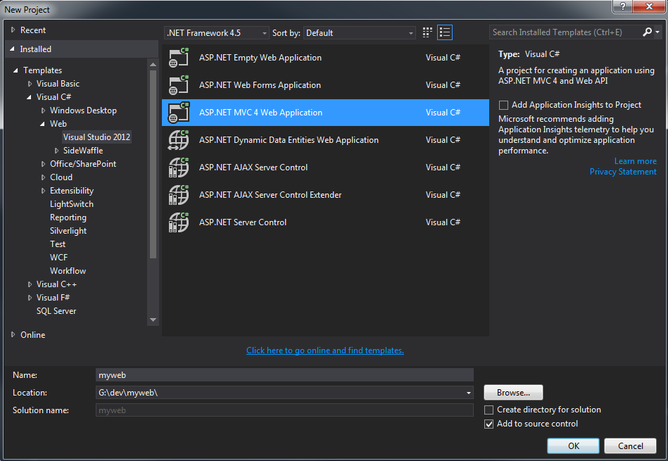

# Umbraco Developer Tutorials

## Beginner Umbraco tutorials for developers

### Tutorial 1 - How to set up Umbraco 7
This is Tutorial one in a series of beginner tutorials for Umbraco 7, that create a custom form
in Umbraco.

*   [Tutorial 1 - How to setup Umbraco 7 with Visual Studio](Tutorial-1-Umbraco7-Setup.md)
*   [Tutorial 2 - Creating a webpage](Tutorial-2-Creating-a-Webpage.md)
*   [Tutorial 3 - Creating and Storing Data in Umbraco](Tutorial-3-Storing-Data-in-Umbraco.md)

#### Pre-Requisites

This tutorial will show you how to install Umbraco using SQL Server Express locally and IIS locally.
Please make sure you have the following installed and configured.  If you don’t want to set up SQL Server Express
you could also just have Umbraco create a local SQLCE database on its own.

*   .NET 4.5 installed on your system (should most likely be installed by default)
*   SQL Server Express
    *   Database called myweb
    *   Database user called appuser with owner access to myweb
*   IIS website
    *   Website called myweb
    *   Set the host name to myweb
    *   For the folder where the website root exists, you need to make sure that your app pool identity (iisapppool\myweb), has full rights to the folder
    *   Make sure that your app pool is using .NET 4
    *   You will need to change the path to the website in a later step, make sure you make this change or you will receive a 404, can not list the contents of the directory error.
*   Hosts file record
    *   Create a new line in your c:\windows\system32\drivers\etc\hosts file for your website (NOTE: You need to open notepad as an administrator in order to be able to edit this file):
    *   127.0.0.1 &nbsp;&nbsp;&nbsp; myweb

#### Creating the Umbraco Project

Create a new Project.  Make sure to use .NET Framework 4.5, MVC 4 Web Application for
Visual Studio 2012 (see image for settings, you probably won’t want to create a
directory and you don’t have to use source control if you don’t want to.
Even though it’s best to always use source control, I won’t be covering that here):

Select Empty and click Ok

After it creates the project in the menu go to Tools → Nuget Package Manager → Package
Manager Console Run the following commands.  During the install it will ask you if you
want to overwrite Global.asx, Enter A and click enter to overwrite all files.

  PM> Install-Package UmbracoCms

  PM> Install-Package UmbracoCms.core

If you don’t install both you will get a weird error about an assembly cannot be loaded twice.

Build the project , Build-->Build Solution

Now double check two things IIS:

*   Open up IIS again and set the path to your website to c:\dev\myweb\myweb (or whatever your path to your website is) since Visual Studio creates an extra folder that you need to take into account.  If you don’t do this you will receive a 404 cannot list the contents of the directory error.
*   Secondly, in IIS make sure your app pool (myweb), is set for .NET 4.  If it’s not you will receive an error in the next step saying “Unrecognized attribute ‘targetFramework’

Open a web browser and go to [http://myweb](http://myweb)

Note: The first time you go to the webpage you will need to type http:// otherwise it will
most likely redirect you to a google search

Type in your name, email and password and click the Customize button (if you are going to
use the built in SQL CE database you can click on Install).

On the next screen, select Microsoft SQL Server.  Type in localhost for your server and myweb
for your database and then appuser for the user and the password you created (these were in
the pre-reqs for this tutorial). Then click on Continue

On the next screen click on “No Thanks, I do not want a starter Website” so that we can start with a blank slate.
It will take a few minutes to install and then it will redirect you to the back-end umbraco admin.

Congratulations, you now have Umbraco Installed!!!

[Next>> Tutorial 2 - Creating a Webpage](Tutorial-2-Creating-a-Webpage.md)
