### Tutorial 3 - Storing Data in Umbraco
This is Tutorial three in a series of beginner tutorials for Umbraco 7

*   [Tutorial 1 - How to setup Umbraco 7 with Visual Studio](Tutorial-1-Umbraco7-Setup.md)
*   [Tutorial 2 - Creating a webpage](Tutorial-2-Creating-a-Webpage.md)
*   [Tutorial 3 - Creating and Storing Data in Umbraco](Tutorial-3-Storing-Data-in-Umbraco.md)

#### Creating the Document Type

Click on the settings menu item in the Umbraco admin and then expand out your document types, and right click on Base and select Create.

Give it a name like Data and uncheck the box for Create matching Template.  We are going to store document types that are solely for the purposes of data here, so we won’t be needing a template.  If you thought you might want a template at some point for the document type then you would want to make sure this box is checked.

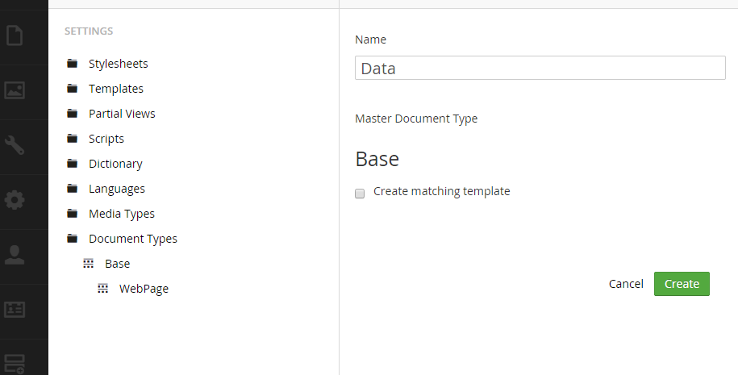

Now right click on the Data Document Type you just created and click Create so that we can create a new document type to store our data.

Give the new document type a name like LunchChoiceData and you can uncheck the Create matching template checkbox for this one too, since we will be.

Switch to the Generic Properties tab.  This is where you will create properties which you can think of like fields for storing data for the form we will be building.  Click the link under Add New Property “Click here to add a new property” and enter the data you see below and then click save in the top right corner:

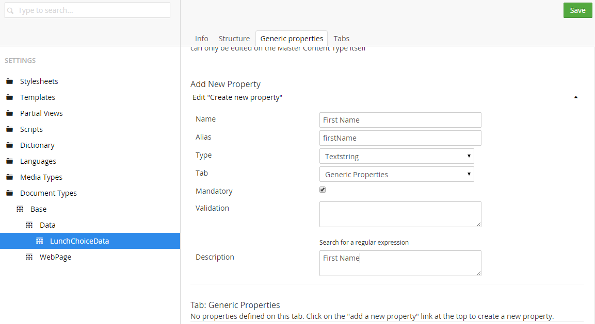

Notice how for the alias, it automatically created that concatenated name for you?  That is that name that you will use in your code when you are working with this field.

Click the add new property link again and create a property with the settings below and click save:

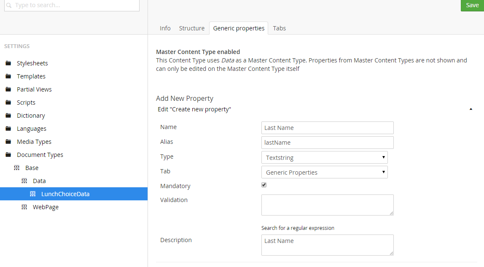

Create one more property with the settings below, this one will be a dropdown box, we will need to create a custom dropdown box and then return to this property and make a change, but for now just select Dropdown

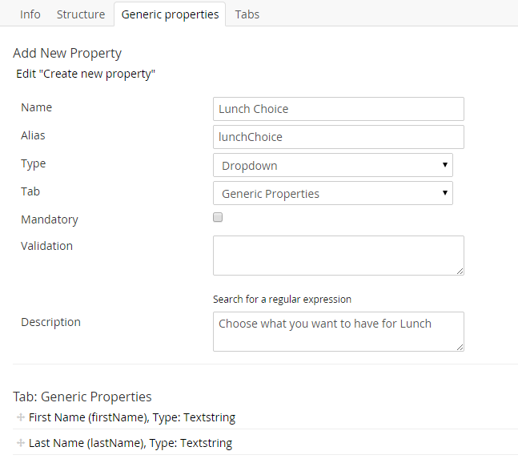

#### Creating the Data Type

Ok, now we have some fields, let’s save this and then go make that custom dropdown box with custom items.  On the left menu select Developer this time and then expand the Data Types.  Here are rwhere all the different types exist including things like checkbox list and dropdown and such.  We are going to create our custom dropdown here.

Right click on Data Types and select Create.

Enter a name for our Data Type, I’ll call it "LunchChoices"

For property Editor, I will select Dropdown list since I want this to be a dropdown and then after I do this I will now see something new on the screen labeled “Add prevalue.”  Prevalues are what Umbraco calls the options that are in the dropdown.  So let’s add some prevalues, after you add them you can re-order them by dragging and dropping.  See the image below:

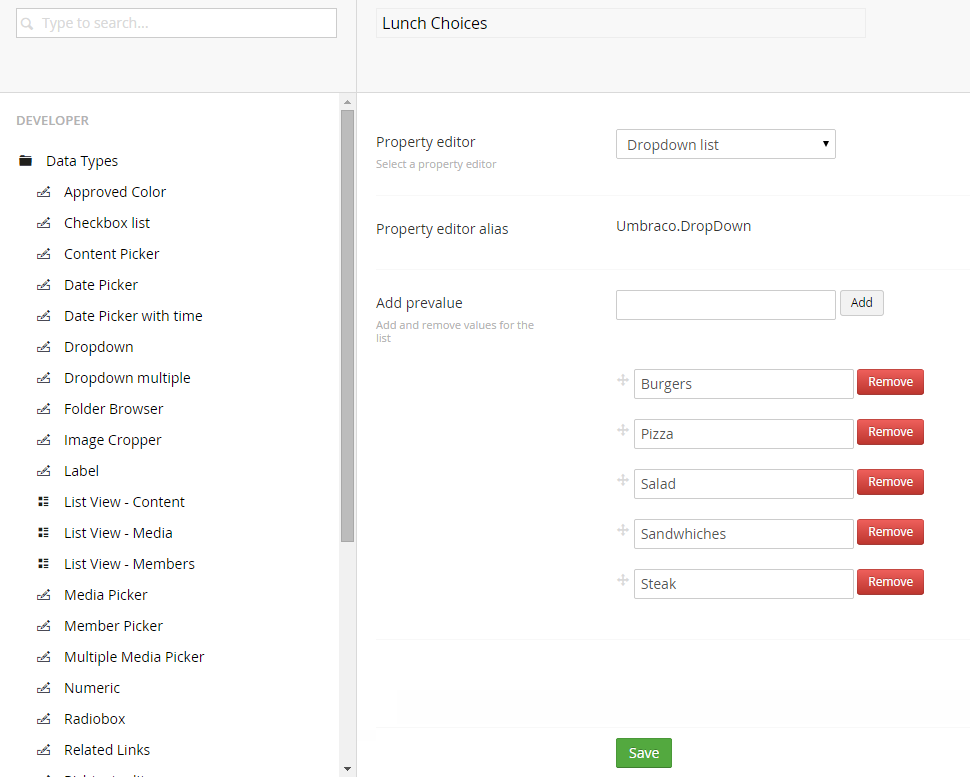

When you are done click Save.

Now we have our Lunch Choices Data Type.  Now click on the Settings menu item and return to your LunchChoiceData Document Type and click on the Generic Properties Tab.  Let’s change the Type of the field to use our new Lunch Choices Data Type.  So click on Lunch Choice and this will let you edit that field.

Next for the Type use the dropdown to change the selection from Dropdown to Lunch Choices.

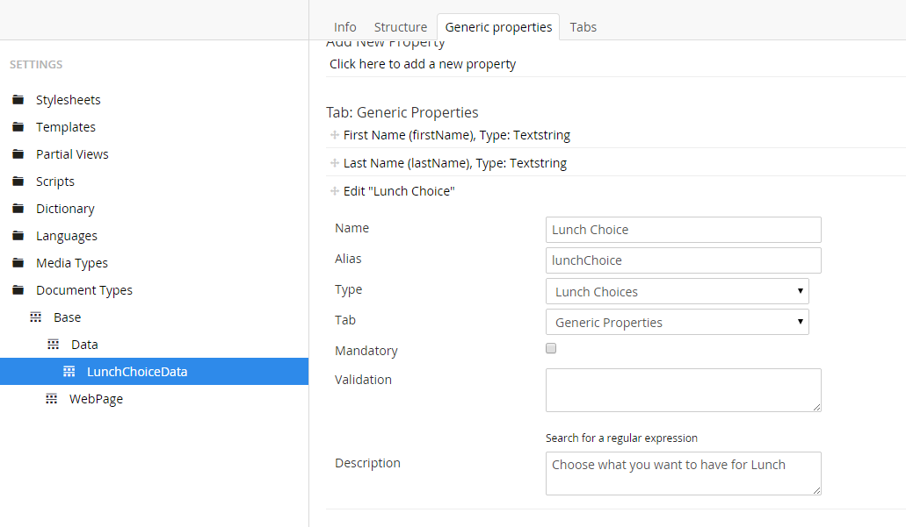

Click Save, now our dropdown will be a list of our Lunch Choices that we entered as prevalues when we created a data type.

#### Creating the Form Page

Now that we have our new LunchChoiceData Document Type we need to give it a home.  We need to create a form webpage for people to enter to tell us what they want for lunch.  So let’s return to the Settings menu and expand out Document Types and right click on WebPage and select Create.  For this new page lets call it LunchFormPage.  Click on the Structure tab and check the box to allow child nodes of the LunchChoiceData.  This will allow the form to store all the lunch choice form submissions data as child nodes.

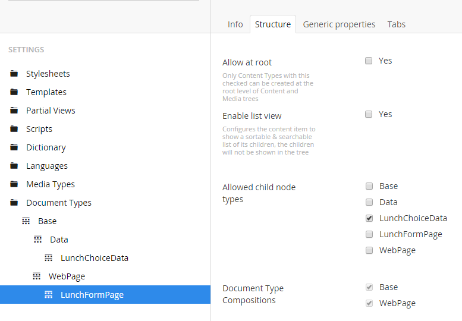

Then click save.

Now we have our LunchFormPage Document Type and our LunchChoiceData Document type, and we are now ready to create the actual webpage (content item) which will use these Document Types and to collect the data from the user.

So lets click on the Content menu item and then right click on Home Page and select Create.  Oops… you should actually see a message from Umbraco:

We are not allowed to create any document types as children of this item because we haven’t allowed the WebPage Document Type to have any children. Let’s go fix that.

Go back to the Settings menu and expand out the Document Types node until you find WebPage and click on WebPage.

Now click the Structure tab and under Allowed child node types select “LunchFormPage” and while we are at it, also select “WebPage” in case in the future we want to create any sub webpages off the home page.  The click Save.  Don’t forget to click Save!

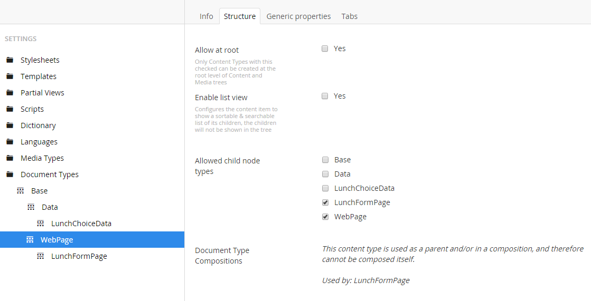

Now go back to the Content menu right click on Home Page and click Create and voila! You should now have the ability to LunchFormPage or WebPage Content as children of the Home Page, click on LunchFormPage.

For the name call it Lunch Chooser and click Save and Publish.  After you publish scroll down and you will see how Umbraco automatically has created routing for your lunch chooser webpage.  It took the name that you give for the content and replaced spaces with hyphens (http://myweb/lunch-chooser):

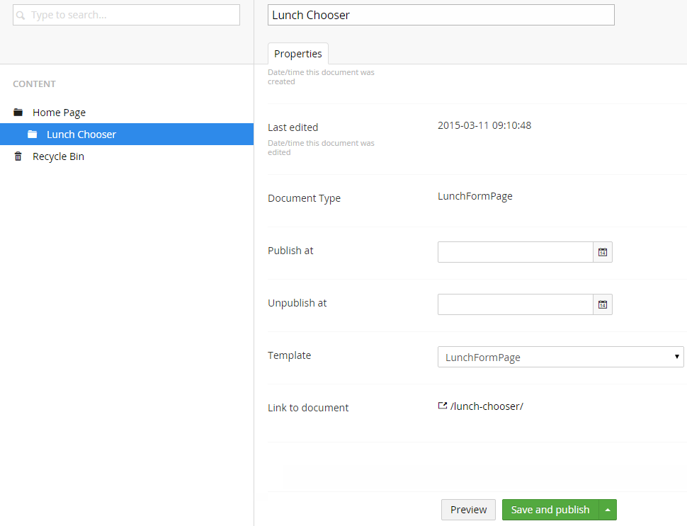

If you got to the http://myweb/lunch-chooser web page you won’t see anything but a blank page.  We will create the form in the next tutorial, however, at this point you can create new lunch choices.  In the content menu right click on the content we just created, Lunch Chooser and click Create.   You will see an option to create a LunchChoiceData.That contains the fields that we created:

Click on LunchChoiceData to create our first submission.

At the top enter a name for the content.  Every piece of content in Umbraco must have a name even items that are going to be primarily used for just storing data.  So let’s give it the name John Smith Lunch Choice 4-15-2015.

Scroll down and you will see our custom fields.  Enter John for the First Name field and then Smith for the Last Name field and then click on the dropdown next to Lunch Choice, and you see that the prevalues we had entered are available as choices.  Select one, and your new content item will look something like:

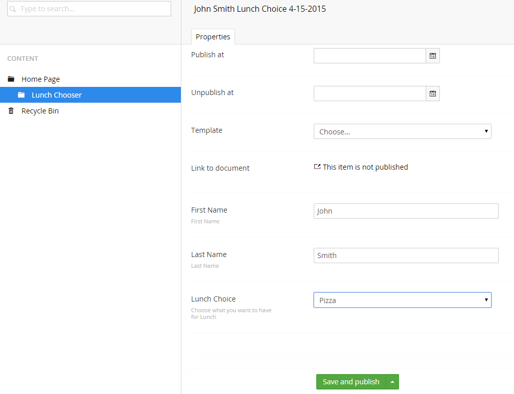

Click Save and Publish

You should notice (if not refresh), a new content item as a child under Lunch Chooser called John Smith Lunch Choice 4-15-2015

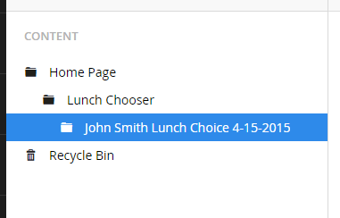

Umbraco has basically handled all the back end CRUD for you.  You can come in here and edit and enter new submissions, however, this doesn’t do your end users any good since you might not want them to have to log into Umbraco.  You might just want them to fill out a form through a web page without needing to understand how Umbraco works.  In the next tutorial we will create a front end custom form so that your users can do just that!
